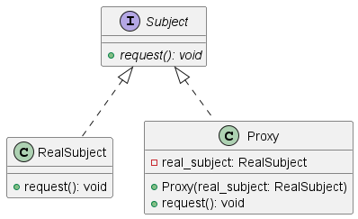
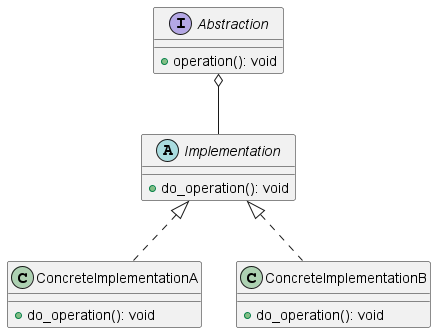
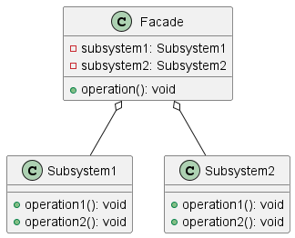
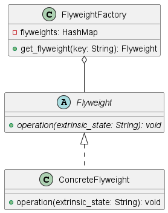

Паттерн "чистой архитектуры" Proxy (Прокси) представляет собой структурный паттерн, который позволяет создавать прокси-объекты, обеспечивающие контроль доступа к другому объекту, называемому реальным объектом. Прокси может выполнять различные дополнительные задачи, такие как ленивая инициализация, кэширование, контроль доступа и т.д., не изменяя при этом интерфейс реального объекта.

Основная идея паттерна Прокси заключается в создании объекта-посредника (прокси), который является заместителем для другого объекта (реального объекта), и клиентский код взаимодействует именно с прокси-объектом, не зная о реальном объекте. Прокси передает вызовы клиентского кода реальному объекту и может выполнять какие-либо дополнительные действия до или после этого.

Пример использования паттерна Прокси может быть следующим:

- Ленивая инициализация: Прокси может отложить создание и инициализацию реального объекта до того момента, когда это действительно необходимо. Например, вместо создания и загрузки большого объема данных сразу, прокси может создать и загрузить реальный объект только при первом обращении к нему.

- Кэширование: Прокси может кэшировать результаты операций реального объекта для повторного использования и увеличения производительности. Например, если у реального объекта есть метод, выполняющий длительные вычисления, прокси может сохранить результаты первого вызова и возвращать их при последующих вызовах с теми же аргументами.

- Контроль доступа: Прокси может проверять права доступа клиентского кода к реальному объекту и принимать решение об отказе или разрешении выполнения операции. Например, если реальный объект представляет некоторую защищенную информацию, прокси может проверять, имеет ли клиентский код достаточные права доступа для выполнения определенных операций.

- Дополнительная логика: Прокси может добавлять дополнительную логику в общую последовательность вызовов методов реального объекта. Например, прокси может собирать статистику о количестве и времени выполнения операций реального объекта.

Основное преимущество паттерна Прокси состоит в том, что он позволяет работать с реальным объектом через прокси-объект, что обеспечивает разделение ответственности и контроль доступа. Кроме того, он также обеспечивает гибкость в изменении поведения реального объекта, не вмешиваясь в клиентский код.

Однако, паттерн Прокси может привести к увеличению сложности кода из-за введения дополнительного уровня абстракции. Кроме того, прокси-объект должен иметь тот же интерфейс, что и реальный объект, чтобы клиентский код мог использовать его без изменений.

В целом, паттерн Прокси может быть полезным инструментом для управления доступом к объектам, а также для добавления дополнительной функциональности и контроля при взаимодействии с ними.

___

Паттерн "Мост" (Bridge) является структурным паттерном, который позволяет отделить абстракцию от ее реализации, чтобы они могли изменяться независимо друг от друга. Центральная идея паттерна Мост состоит в том, чтобы разделить иерархию классов на две отдельные иерархии - абстракцию и реализацию. Это позволяет изменять их независимо друг от друга.

Основная мотивация для использования паттерна Мост заключается в том, чтобы избежать жестких связей между абстракцией и реализацией, чтобы изменения одной из них не приводили к изменениям или перекомпиляции другой. Это позволяет более гибко изменять и расширять систему.

Пример использования паттерна Мост может быть следующим:

- Разделение абстракции и реализации: Когда у вас есть иерархия классов, где каждый класс имеет два измерения изменения, можно использовать паттерн Мост. Например, если у вас есть иерархия "Форма" и иерархия "Цвет", паттерн Мост позволит вам комбинировать различные формы с разными цветами без необходимости создания подклассов каждой комбинации.

- Управление разнообразием реализаций: Паттерн Мост помогает управлять разнообразием реализаций, позволяя добавлять новые реализации, не затрагивая существующий код абстракции. Например, если у вас есть абстракция "Сообщение" и реализации для разных типов сообщений, вы можете добавить новый тип сообщения, создав новую реализацию, без изменения кода абстракции.

- Расширение возможностей системы: Паттерн Мост позволяет расширять возможности системы, добавляя новые абстракции и реализации в независимости друг от друга. Например, если у вас есть абстракция "Транспортное средство" и реализации для разных типов транспорта, вы можете добавить новый тип транспорта или новую функциональность для существующего типа транспорта, не затрагивая существующий код.

Основное преимущество паттерна Мост состоит в его способности разделять абстракцию и реализацию, что делает систему более гибкой, расширяемой и легкой для изменений. Он также помогает снизить степень связанности между классами и упростить тестирование и поддержку кода.

Однако, применение паттерна Мост может привести к увеличению сложности кода из-за введения дополнительного уровня абстракции и реализации. Кроме того, его использование может быть нецелесообразно, если у вас нет необходимости в разделении абстракции и реализации или система не предполагает будущего расширения разнообразия реализаций.

В целом, паттерн Мост может быть полезным инструментом для создания гибкой архитектуры системы и отделения абстракции от ее реализации.

___

Facade, также известный как фасад, является структурным шаблоном проектирования, который позволяет предоставить простой и унифицированный интерфейс для взаимодействия с более сложной системой.

Фасад выступает в роли прослойки между клиентским кодом и внутренними компонентами системы. Он предоставляет упрощенный интерфейс, скрывая детали и сложность работы с каждым из внутренних компонентов системы. Фасад упрощает взаимодействие с системой, делая ее более понятной и интуитивной для клиентского кода.

Преимущества использования паттерна Facade включают:

1. Уменьшение сложности системы: Фасад скрывает сложность внутренних компонентов системы и предоставляет простой и понятный интерфейс для клиентского кода. Это упрощает работу с системой и уменьшает сложность разработки.

2. Улучшение поддерживаемости: Фасад может служить точкой входа для клиентского кода, что позволяет легко изменять или заменять внутренние компоненты системы без влияния на клиентский код.

3. Сокрытие деталей реализации: Фасад скрывает детали реализации внутренних компонентов системы, ограничивая доступ клиентского кода только к необходимому функционалу. Это повышает уровень абстракции и упрощает взаимодействие с системой.

Однако, следует быть осторожным с применением паттерна Facade, чтобы не создавать слишком много функционала в одном месте. Если фасад содержит большое количество функций и компонентов, он может стать сам по себе сложным и трудным в поддержке.

Пример применения паттерна Facade может быть веб-сервис, который предоставляет упрощенный интерфейс для различных внутренних сервисов (базы данных, аутентификации, платежных систем и т.д.) клиентскому коду. Фасад скрывает детали работы с каждым из этих сервисов и предоставляет простые методы для выполнения необходимых операций.

В итоге, паттерн чистой архитектуры Facade помогает создать понятный, гибкий и простой в использовании интерфейс для работы с более сложной системой.

___

Паттерн Flyweight (Приспособленец) является структурным шаблоном проектирования, который позволяет эффективно использовать разделяемые объекты с целью сокращения использования памяти и улучшения производительности.

Основная идея паттерна Flyweight заключается в том, чтобы разделить состояние объектов на внутреннее (разделяемое) и внешнее (неразделяемое). Вместо создания отдельного объекта для каждого уникального состояния, используется общий объект, в котором хранятся разделяемые данные. Таким образом, объекты Flyweight становятся легковесными, потому что они содержат только неразделяемую часть состояния.

Преимущества использования паттерна Flyweight включают:

1. Экономия памяти: Паттерн Flyweight позволяет сократить использование памяти, так как общие разделяемые объекты занимают гораздо меньше места, чем отдельные объекты для каждого уникального состояния.

2. Улучшение производительности: Использование общих объектов позволяет избежать создания новых объектов для одинаковых состояний. Это способствует уменьшению времени выполнения и повышению производительности при работе с большим числом объектов.

3. Управление изменяемыми состояниями: Объекты Flyweight неизменяемы и имеют разделяемые данные. Если состояние объекта может изменяться, оно должно поддерживаться вне объекта Flyweight, что делает управление изменяемыми состояниями проще и более надежным.

Пример применения паттерна Flyweight может быть редактор графических объектов, где различные объекты (например, точки, линии, прямоугольники) могут иметь одинаковое состояние (например, цвет, толщина линии), и используя паттерн Flyweight, можно общие объекты для разделяемого состояния, такие как цвет, чтобы сократить использование памяти.

В целом, паттерн Flyweight позволяет эффективно использовать память, улучшить производительность и управлять состояниями в системах, где множество объектов может иметь одно и то же состояние.